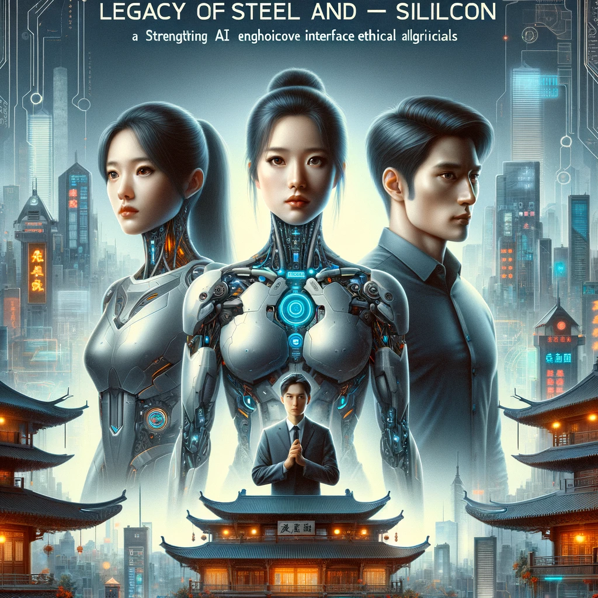
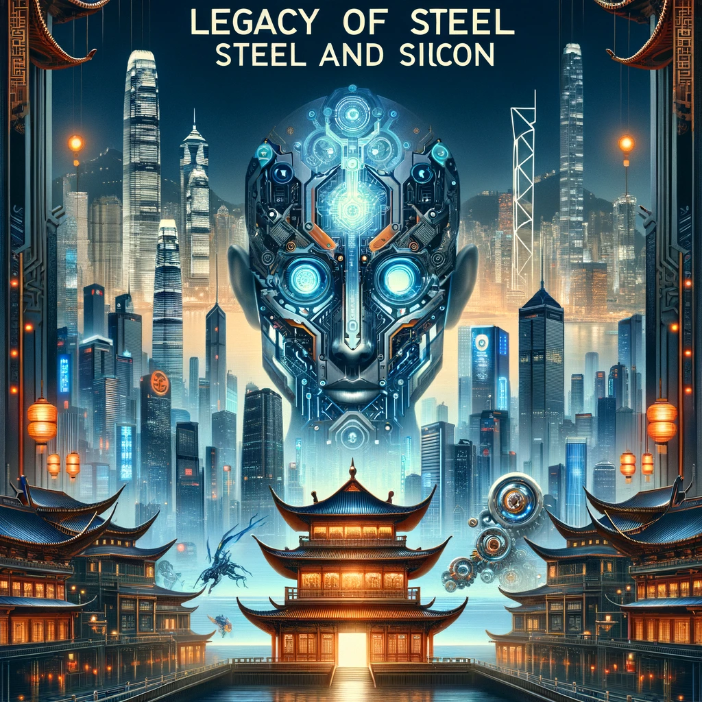

 

### Tiêu đề: "Di sản của Thép và Silicon"

#### Cài đặt:
- Năm đó là năm 2124, tại một châu Á có công nghệ tiên tiến, nơi robot và AI đã tích hợp liền mạch vào xã hội.
- Cảnh quan thành phố là sự pha trộn giữa những tòa nhà chọc trời tương lai, ánh đèn neon và kiến trúc truyền thống châu Á.

#### Sơ lược cốt truyện:

##### Chương 1: Sự kế thừa
- Giới thiệu gia đình Zhang, người có ảnh hưởng trong lĩnh vực phát triển robot và AI.
- Tộc trưởng, một nhà phát triển AI nổi tiếng, qua đời, để lại khối tài sản khổng lồ và một chương trình AI bí ẩn.

##### Chương 2: Sự biến đổi
- Các thành viên gia đình Zhang, đã được tích hợp một phần với các cải tiến về AI và robot, đang tranh luận về quyền thừa kế.
- Mỗi thành viên thể hiện khả năng AI và tính năng robot độc đáo, phản ánh tính cách của họ.

##### Chương 3: Câu đố
- Di chúc tiết lộ một thách thức: để mở khóa chương trình AI cuối cùng, gia đình phải giải một loạt câu đố và nhiệm vụ thấm sâu vào văn hóa và lịch sử châu Á.

##### Chương 4: Sự chia cắt
- Các thành viên trong gia đình chia thành các phe phái, mỗi phe sử dụng kỹ năng công nghệ cao và khả năng AI của mình để vượt qua những người khác.
- Câu chuyện nêu bật sự kết hợp giữa các hình thức tiên tiến của họ với các chiến lược và giá trị truyền thống của châu Á.

##### Chương 5: Thử thách của truyền thống
- Những thách thức bao gồm việc diễn giải các nghi lễ và lễ hội truyền thống của châu Á bằng công nghệ cao, đòi hỏi cả kiến thức về công nghệ và văn hóa.
- Khả năng robot và AI của gia đình được kiểm tra dựa trên trí tuệ và phong tục cổ xưa.

##### Chương 6: Bí mật được hé lộ
- Khi họ tiến bộ, những bí mật và lịch sử gia đình được tiết lộ, cho thấy công nghệ đã ảnh hưởng đến mối quan hệ con người và di sản văn hóa của họ như thế nào.

##### Chương 7: AI tối thượng
- Câu đố cuối cùng dẫn đến sự hiểu biết rằng chương trình AI không chỉ là một công cụ mà còn là hiện thân của trí tuệ và các giá trị của tộc trưởng.

##### Chương 8: Hòa giải
- Gia đình nhận thức được tầm quan trọng của di sản và sự đoàn kết của mình đối với của cải vật chất.
- Họ quyết định sử dụng chương trình AI để cải thiện xã hội, kết hợp các giá trị truyền thống với tầm nhìn tương lai.

#### Chủ đề:
- Sự mâu thuẫn giữa truyền thống và hiện đại.
- Ý nghĩa đạo đức của AI và robot trong xã hội loài người.
- Tầm quan trọng của di sản văn hóa trong bối cảnh tiến bộ công nghệ.
- Động lực gia đình và cuộc tìm kiếm di sản phổ quát.

#### Nhân vật:
- Mỗi thành viên trong gia đình sẽ có một tính cách và vai trò riêng biệt, phản ánh những khía cạnh khác nhau của văn hóa châu Á và tiềm năng của công nghệ tương lai.

Bằng cách kết hợp AI và robot tiên tiến với truyền thống sâu xa của châu Á và chủ đề kinh điển về mối thù gia đình về quyền thừa kế, "Di sản thép và silicon" mang đến một khám phá độc đáo về cách công nghệ có thể định hình không chỉ khả năng của chúng ta mà còn cả văn hóa và gia đình của chúng ta. trái phiếu.

### Chương 1: Sự kế thừa

#### Cài đặt:
- Thành phố Tân Hồng Kông nhộn nhịp, rực rỡ ánh đèn neon, sự kết hợp giữa công nghệ tiên tiến và di sản văn hóa lâu đời.
- Dinh thự Zhang sang trọng, sự pha trộn giữa kiến trúc truyền thống của Trung Quốc với robot tiên tiến và AI được tích hợp vào chính cấu trúc của nó.

#### Tóm tắt:

Chương mở đầu với cảnh biệt thự lớn của Zhang trở nên sống động vào đầu giờ sáng, hệ thống AI của nó nhẹ nhàng đánh thức cư dân. Gia đình Zhang, có ảnh hưởng trong lĩnh vực robot và AI, nổi tiếng vì những đóng góp cho tiến bộ công nghệ, sự giàu có của họ là minh chứng cho nhiều thế hệ đổi mới.

##### Nhân vật chính:
- Jun Zhang, con út trong gia đình Zhang, một kỹ sư AI có mối quan tâm đặc biệt đến việc phát triển AI có đạo đức. Không giống như các anh chị em của mình, Jun ít quan tâm đến tài sản gia đình mà tập trung hơn vào tiềm năng của công nghệ để mang lại lợi ích cho xã hội.

##### Sự diệt vong của Tổ sư:
- Chương này bắt đầu với việc gia đình nhận được tin tộc trưởng Jian Zhang đột ngột qua đời. Jian là người có tầm nhìn xa trong lĩnh vực phát triển AI, được biết đến với niềm tin vào việc hài hòa công nghệ với các giá trị truyền thống.

##### Đọc di chúc:
- Gia đình tập trung tại đại sảnh, nơi luật sư của Jian trình bày bản di chúc ba chiều. Di chúc tiết lộ một bước ngoặt đáng ngạc nhiên - khối tài sản khổng lồ và chương trình AI đột phá, mới nhất của tộc trưởng sẽ không được phân chia theo truyền thống. Thay vào đó, nó ẩn sau một thử thách, được thiết kế để kiểm tra những người thừa kế cả về trí tuệ và đạo đức.

##### Các thách thức:
- Giọng của Jian, được lưu giữ trong AI, giải thích thách thức: để mở khóa quyền thừa kế, gia đình phải giải một loạt câu đố và nhiệm vụ phức tạp đan xen với di sản văn hóa phong phú của họ. Các nhiệm vụ được thiết kế để đảm bảo rằng người thừa kế chiến thắng không chỉ thông thạo về công nghệ mà còn hiểu sâu sắc và tôn trọng cội nguồn văn hóa của họ.

##### Phản ứng của gia đình:
- Sự tiết lộ đã gây xôn xao trong gia đình. Hai anh em, đã được cải tiến với nhiều khả năng AI và robot khác nhau, bắt đầu suy đoán và nghiên cứu. đánh giá.
- Jun bị giằng xé giữa việc không quan tâm đến vận may và sự tò mò về sự sáng tạo AI cuối cùng của cha mình.

##### Di sản AI:
- Chương này kết thúc với cái nhìn thoáng qua về nghiên cứu riêng của Jian Zhang, tiết lộ giao diện AI tinh vi gợi ý về tính chất nâng cao của chương trình cuối cùng. AI này dường như không chỉ là một cỗ máy; đó là kho lưu trữ trí tuệ, đạo đức của Jian và có thể là một thông điệp ẩn giấu cho gia đình anh.

#### Các yếu tố chính:
- Sự tương phản giữa các yếu tố truyền thống của dinh thự Trung Quốc và công nghệ tương lai minh họa di sản của gia đình và sự phát triển của nó sang thời hiện đại.
- Giới thiệu sự năng động của gia đình, tạo tiền đề cho những xung đột và liên minh trong tương lai.
- Báo trước tầm quan trọng của chương trình AI cuối cùng và tác động tiềm tàng của nó đối với gia đình và hơn thế nữa.

#### Chủ đề:
- Di sản và sự kế thừa trong bối cảnh thế giới công nghệ phát triển nhanh chóng.
- Sự giao thoa giữa giá trị truyền thống và đổi mới tương lai.
- Những tình huống khó xử về đạo đức và đạo đức do AI tiên tiến đặt ra.

Chương này đặt ra giai điệu cho câu chuyện, giới thiệu các nhân vật chính, thế giới của họ và xung đột trung tâm sẽ thúc đẩy câu chuyện đi tiếp. Nó nêu bật sự cân bằng tinh tế giữa tôn trọng truyền thống và đón nhận tương lai, một chủ đề sẽ được khám phá sâu hơn trong các chương tiếp theo.

### Chương 2: Sự biến đổi

#### Cài đặt:
- Phòng thí nghiệm công nghệ cao của gia đình Zhang, nằm trong dinh thự, trưng bày những tiến bộ mới nhất về robot và AI.
- Những con phố nhộn nhịp của Neo-Hong Kong, nơi những khu chợ truyền thống ẩn mình dưới bóng những tòa nhà chọc trời cao chót vót và những biển hiệu đèn neon.

#### Tóm tắt:

Chương 2 đi sâu hơn vào sự biến đổi cá nhân và khả năng của các thành viên gia tộc Zhang, tạo tiền đề cho cuộc cạnh tranh quyền thừa kế sắp xảy ra.

##### Tụ Hội Anh Em:
- Chương này mở đầu bằng việc anh chị em tập trung tại phòng thí nghiệm hiện đại, mỗi người thể hiện những cải tiến AI và khả năng robot độc đáo của mình.
- Mei Zhang, chị cả, là bậc thầy về kỹ thuật robot, cơ thể của cô được tăng cường các bộ xương ngoài tăng cường sức mạnh.
- Li Zhang, một nhà tư tưởng chiến lược, đã tích hợp AI để nâng cao khả năng xử lý nhận thức, có khả năng phân tích và lập chiến lược với tốc độ siêu phàm.
- Jun, nhân vật chính của chúng ta, sở hữu khả năng tích hợp tinh tế hơn, tập trung vào các thuật toán đạo đức và tương tác giữa con người với AI.

##### Căng thẳng gia tăng:
- Cuộc họp nhanh chóng trở nên căng thẳng khi hai anh em tranh luận về chiến lược giải câu đố của cha mình. Mỗi người đều tin rằng năng lực công nghệ đặc biệt của họ mang lại cho họ một lợi thế.
- Mei nhấn mạnh vào sức mạnh vũ phu và sự thống trị về công nghệ, trong khi Li ủng hộ việc hoạch định chiến lược và phân tích dữ liệu. Trong khi đó, Jun đề xuất một cách tiếp cận cân bằng hơn, tôn trọng cả khía cạnh công nghệ và văn hóa của thách thức.

##### Hồi tưởng về quá khứ:
- Khi họ tranh luận, những đoạn hồi tưởng tiết lộ mối quan hệ phức tạp của hai anh em với cha và với nhau, bao gồm những xung đột và ganh đua trong quá khứ, nhưng cũng có những khoảnh khắc hợp tác và tôn trọng lẫn nhau.

##### Manh mối đầu tiên:
- Giao diện AI trong nghiên cứu của Jian Zhang được kích hoạt, đưa ra câu đố đầu tiên. Đó là một thông điệp khó hiểu gợi ý về một địa điểm trong dinh thự, gắn liền với một sự kiện quan trọng trong lịch sử gia đình họ.
- Hai anh em chia nhau đi giải mã manh mối, mỗi người sử dụng khả năng riêng của mình. Mei sử dụng sức mạnh robot của mình để truy cập vào các khu vực ẩn, Li phân tích dữ liệu lịch sử và Jun khai thác mạng lưới AI của dinh thự.

##### Khám phá bí mật ẩn giấu:
- Cuộc tìm kiếm dẫn họ đến một căn phòng bí mật trong biệt thự, nơi họ tìm thấy một bản ghi âm ba chiều của cha mình. Ông nói về tầm quan trọng của việc cân bằng sức mạnh, trí thông minh và đạo đức khi đối mặt với tiến bộ công nghệ.
- Đoạn ghi âm kết thúc với gợi ý về thử thách tiếp theo, nằm ở đâu đó trong thành phố.

#### Các yếu tố chính:
- Việc khám phá những cải tiến công nghệ độc đáo của mỗi anh chị em, phản ánh tính cách và vai trò của họ trong gia đình.
- Việc sử dụng lịch sử của gia đình và những lời dạy của Jian như một phần không thể thiếu trong các câu đố và thử thách.
- Giới thiệu thế giới rộng lớn hơn của Neo-Hong Kong, một thành phố tượng trưng cho sự kết hợp giữa truyền thống và công nghệ.

#### Chủ đề:
- Tác động của công nghệ đến bản sắc cá nhân và động lực gia đình.
- Sự đấu tranh giữa tham vọng cá nhân và trách nhiệm tập thể.
- Những cân nhắc về mặt đạo đức trong việc theo đuổi tiến bộ công nghệ.

Chương này không chỉ nâng cao cốt truyện mà còn giúp người đọc hiểu sâu hơn về các nhân vật và động cơ của họ. Nó thiết lập một mạng lưới những thách thức phức tạp mà gia đình Zhang sẽ phải đối mặt, cả bên trong lẫn bên ngoài, khi họ cố gắng khám phá di sản của cha mình và hiểu ý nghĩa thực sự của quyền thừa kế trong một thế giới bị thống trị bởi AI và robot.

### Chương 3: Câu đố

#### Cài đặt:
- Mạng lưới đường phố và ngõ hẻm phức tạp ở Neo-Hong Kong, blending kiến trúc cổ xưa với công nghệ tương lai.
- Trung tâm chỉ huy kỹ thuật số của gia đình Zhang, được trang bị các công cụ và giao diện AI tiên tiến.

#### Tóm tắt:

Trong chương này, anh chị em họ Zhang bắt đầu làm sáng tỏ bí ẩn đầu tiên về người cha quá cố của họ, dẫn họ vào cuộc hành trình đan xen lịch sử của gia đình họ với tấm thảm văn hóa phong phú của Tân Hồng Kông.

##### Nhiệm vụ bắt đầu:
- Chương mở đầu bằng cảnh hai anh em phân tích manh mối còn sót lại trong đoạn ghi âm của cha mình. Nó hướng họ tới một khu phố cổ ở Tân Hồng Kông, nơi được biết đến là nơi bảo tồn văn hóa truyền thống giữa những tiến bộ hiện đại.
- Mỗi anh chị em quyết định tiếp cận manh mối theo cách riêng của mình, phản ánh những cải tiến công nghệ và triết lý cá nhân riêng biệt của họ.

##### Chiến lược đa dạng:
- Mei Zhang, dựa vào sức mạnh thể chất của mình, khám phá các tòa nhà cổ và kho lưu trữ vật chất.
- Li Zhang, với khả năng nhận thức được nâng cao, đi sâu vào cơ sở dữ liệu kỹ thuật số và hồ sơ lịch sử.
- Jun Zhang, cân bằng công nghệ với trực giác, tương tác với các nhà sử học địa phương và khám phá các địa danh văn hóa.

##### Những thách thức về văn hóa:
- Các anh chị gặp phải nhiều nhiệm vụ khác nhau không chỉ đòi hỏi kỹ năng công nghệ mà còn phải có sự hiểu biết sâu sắc về truyền thống và lịch sử châu Á.
- Họ giải mã những bài thơ cổ, định hướng qua một mê cung giống như một khu vườn truyền thống của Trung Quốc và tương tác với các mô phỏng AI của các nhân vật lịch sử.

##### Sự hợp tác bất ngờ:
- Bất chấp sự ganh đua, hai anh em thấy mình buộc phải hợp tác ở một số giai đoạn nhất định, kết hợp sức mạnh của mình để giải những câu đố đặc biệt khó khăn.
- Thỏa thuận đình chiến tạm thời này mang đến một thoáng tình bạn và cái nhìn thoáng qua về tiềm năng của họ như một lực lượng thống nhất.

##### Sự mặc khải:
- Nhiệm vụ cuối cùng dẫn họ đến một nhà hát cũ, nơi AI tái hiện một vở kịch lịch sử nổi tiếng sẽ cung cấp mảnh ghép cuối cùng.
- Giải quyết được nó, họ phát hiện ra một thông điệp ẩn giấu từ cha mình, nhấn mạnh tầm quan trọng của việc hiểu rõ cội nguồn của một người và sự khôn ngoan trong quá khứ.

##### Trở về dinh thự:
- Với những hiểu biết mới và sự đánh giá cao hơn về di sản của mình, cặp anh em quay trở lại dinh thự, nơi giao diện AI tiết lộ địa điểm của thử thách tiếp theo.
- Chương này kết thúc với cảnh các anh chị em suy ngẫm về thông điệp của cha mình và nó ảnh hưởng như thế nào đến những nỗ lực và tham vọng cá nhân của họ.

#### Các yếu tố chính:
- Việc khám phá các quận giàu văn hóa của Tân Hồng Kông, thể hiện sự pha trộn giữa cái cũ và cái mới.
- Miêu tả những thách thức đòi hỏi sự cân bằng giữa sự nhạy bén về công nghệ và hiểu biết về văn hóa.
- Sự năng động ngày càng tăng giữa các anh chị em, gợi ý về những tầng sâu hơn trong mối quan hệ của họ.

#### Chủ đề:
- Tầm quan trọng của di sản văn hóa trong việc định hình các công nghệ và triết lý tương lai.
- Sự cân bằng giữa sức mạnh cá nhân và nỗ lực hợp tác.
- Ảnh hưởng của lịch sử và truyền thống trong bối cảnh công nghệ phát triển nhanh chóng.

Chương 3 của "Di sản thép và silicon" không chỉ phát triển câu chuyện mà còn đi sâu vào việc khám phá chủ đề giữa truyền thống và công nghệ. Nó thách thức các nhân vật (và độc giả) cân nhắc xem quá khứ có thể cung cấp thông tin và làm phong phú thêm cho tương lai như thế nào, đặc biệt là trong một thế giới mà công nghệ ngày càng định hình trải nghiệm của con người.

### Chương 4: Sự chia cắt

#### Cài đặt:
- Khu công nghiệp công nghệ cao của Neo-Hong Kong, trung tâm nghiên cứu và phát triển công nghệ tiên tiến.
- Nhiều địa điểm khác nhau trong thành phố thể hiện sự kết hợp giữa di sản châu Á cổ đại và công nghệ tương lai.

#### Tóm tắt:

Chương 4 tập trung vào sự chia rẽ ngày càng tăng giữa anh em nhà Zhang khi mỗi người theo đuổi thử thách tiếp theo, sử dụng khả năng độc đáo của mình để vượt qua nhau trong cuộc đua giành quyền thừa kế.

##### Cạnh tranh leo thang:
- Chương bắt đầu với việc anh chị em phân tích manh mối tiếp theo, dẫn họ đến khu công nghiệp của thành phố.
- Sự cạnh tranh trở nên khốc liệt hơn, mỗi anh chị em càng quyết tâm giành chiến thắng, thể hiện sức mạnh công nghệ và sự nhạy bén chiến lược của mình.

##### Trò chơi sức mạnh của Mei:
- Mei Zhang thực hiện cách tiếp cận trực tiếp, sử dụng sức mạnh robot và các mối liên hệ trong ngành của mình để có quyền truy cập vào các khu vực và thông tin độc quyền.
- Cô đối đầu với các công ty công nghệ đối thủ, khẳng định sự thống trị của gia tộc Zhang trong lĩnh vực này.

##### Nước đi được tính toán của Li:
- Li Zhang sử dụng khả năng phân tích tiên tiến của mình để đột nhập vào các mạng an toàn và thu thập dữ liệu quan trọng.
- Anh ta thao túng xu hướng thị trường để tạo ra sự chuyển hướng, cho phép anh ta điều tra manh mối mà không bị can thiệp.

##### Cách tiếp cận đạo đức của Jun:
- Jun, không thoải mái với những chiến thuật hung hãn của anh chị em mình, nên tập trung vào một cách tiếp cận có đạo đức hơn.
- Anh cộng tác với các nhóm đạo đức AI và cộng đồng công nghệ địa phương, đạt được những hiểu biết sâu sắc thông qua sự tôn trọng và hiểu biết lẫn nhau.

##### Suy ngẫm về văn hóa:
- Thử thách dẫn họ đi qua các khu vực phản ánh lịch sử văn hóa của thành phố, buộc họ phải tiếp xúc với các nghệ nhân và người xưa truyền thống.công nghệ t.
- Họ phải tích hợp các phương pháp truyền thống này với công nghệ tiên tiến để giải các câu đố phức tạp.

##### Đỉnh điểm căng thẳng:
- Khi họ đến gần mảnh ghép tiếp theo, cuộc cạnh tranh trở nên nóng lên, dẫn đến sự đối đầu giữa hai anh em.
- Họ xung đột về phương pháp và động cơ, bộc lộ những xung đột và oán giận cá nhân sâu sắc hơn.

##### Một khoảnh khắc nhận ra:
- Chương lên đến cao trào với cảnh kịch tính khi hành động của hai anh em vô tình gây nguy hiểm cho một di tích lịch sử, buộc họ phải tạm dừng và xem xét lại hậu quả của cuộc cạnh tranh tàn nhẫn của mình.
- Jun đóng vai trò quan trọng trong việc hòa giải tình huống này, nhắc nhở các anh chị em của mình về những giá trị của cha họ và trách nhiệm đi kèm với sức mạnh công nghệ của họ.

#### Các yếu tố chính:
- Mô tả khu vực công nghiệp của Tân Hồng Kông như một biểu tượng của tiến bộ công nghệ hiện đại.
- Sự tương phản giữa phương pháp công nghệ cao của anh chị em và các yếu tố truyền thống cần có để giải các câu đố.
- Việc khám phá những ý nghĩa đạo đức của khả năng công nghệ của họ.

#### Chủ đề:
- Những tình thế khó xử về mặt đạo đức do việc theo đuổi quyền lực và sự giàu có trong một xã hội công nghệ tiên tiến.
- Sự xung đột giữa tham vọng cá nhân và trách nhiệm đạo đức.
- Tầm quan trọng của việc bảo tồn di sản văn hóa trong bối cảnh tiến bộ công nghệ nhanh chóng.

Trong Chương 4, "Sự chia rẽ", câu chuyện đi sâu vào sự phức tạp của động lực gia đình trong bối cảnh những thách thức về công nghệ và đạo đức. Nó nêu bật những xung đột nảy sinh khi tham vọng, công nghệ và truyền thống giao nhau, tạo tiền đề cho những bước phát triển tiếp theo trong hành trình tìm kiếm của gia đình Zhang.

### Chương 5: Thử thách của truyền thống

#### Cài đặt:
- Một loạt các địa điểm có ý nghĩa văn hóa ở Tân Hồng Kông, mỗi địa điểm đại diện cho một khía cạnh khác nhau của di sản và lịch sử Châu Á.
- Quê hương của gia đình Zhang, một nơi có bề dày truyền thống và lịch sử, hiện được trang bị những tiến bộ công nghệ mới nhất.

#### Tóm tắt:

Chương 5 đưa anh chị em nhà Zhang vượt qua một loạt thử thách đòi hỏi họ phải gắn bó sâu sắc với di sản văn hóa của mình, kiểm tra sự hiểu biết của họ về các giá trị truyền thống và khả năng tích hợp những giá trị này với năng lực công nghệ của họ.

##### Nhà Tổ:
- Chương bắt đầu với cảnh hai anh em trở về quê hương, nơi họ hiếm khi đến thăm, giờ đây là sự pha trộn giữa kiến trúc cổ xưa và công nghệ hiện đại.
- Họ phát hiện ra manh mối tiếp theo dẫn họ đến một loạt lễ hội và nghi lễ truyền thống của châu Á, mỗi lễ hội đều có một bước ngoặt về công nghệ.

##### Chuyển thể của Mei:
- Mei Zhang thấy mình không còn phù hợp với bối cảnh truyền thống nhưng thích nghi bằng cách sử dụng các cải tiến về robot để tương tác với các khía cạnh vật lý của nghi lễ.
- Cô ấy nhận được sự đánh giá cao mới về các kỹ năng thể chất và sự khéo léo liên quan đến những truyền thống này.

##### Phương pháp phân tích của Li:
- Li Zhang sử dụng khả năng nhận thức được tăng cường bởi AI của mình để giải mã ý nghĩa biểu tượng và tài liệu tham khảo lịch sử trong các nghi lễ.
- Anh đấu tranh với những khía cạnh nhân văn, tình cảm hơn của truyền thống nhưng học cách trân trọng chiều sâu của kiến thức văn hóa.

##### Sự hiểu biết cân bằng của Jun:
- Jun Zhang vượt trội trong những thử thách này, sử dụng cách tiếp cận cân bằng giữa công nghệ và truyền thống.
- Anh ấy tương tác với những người lớn tuổi và các bậc thầy về nghệ thuật truyền thống, thu được những hiểu biết sâu sắc giúp giải quyết các câu đố.

##### Một loạt nghi thức:
- Các anh chị tham gia tái hiện Lễ hội Thuyền rồng bằng công nghệ cao, sử dụng thuyền điều khiển bằng AI đòi hỏi kiến thức về lịch sử và ý nghĩa của lễ hội.
- Họ giải một câu đố phức tạp trong dịp Trung thu, tích hợp công thức làm bánh trung thu với thuật toán mật mã.

##### Suy ngẫm về di sản:
- Những thử thách này buộc anh chị em phải kết nối với cội nguồn văn hóa của mình, phản ánh lịch sử và các giá trị truyền thống của gia đình họ đã định hình nên hiện tại của họ như thế nào.
- Họ bắt đầu thấy việc cha họ nhấn mạnh vào việc tôn trọng truyền thống có thể đóng vai trò quan trọng như thế nào trong việc hướng dẫn họ sử dụng công nghệ.

##### Một sự thay đổi trong động lực học:
- Những trải nghiệm tại các lễ hội này làm dịu đi sự ganh đua giữa anh chị em, khi họ bắt đầu trân trọng những điểm mạnh của nhau và giá trị di sản chung của mình.
- Chương này kết thúc với việc họ nhận được tin nhắn từ AI của cha mình, ám chỉ rằng thử thách cuối cùng sẽ yêu cầu họ đoàn kết sức mạnh của mình.

#### Các yếu tố chính:
- Sự kết hợp của các lễ hội và nghi lễ truyền thống châu Á, được tái hiện lại bằng công nghệ tương lai.
- Sự phát triển cá nhân của mỗi anh chị em khi họ kết nối lại với cội nguồn văn hóa của mình.
- Sự chuyển dần từ cạnh tranh sang hợp tác giữa anh chị em với nhau.

#### Chủ đề:
- Tầm quan trọng của việc hiểu biết và tôn trọng di sản văn hóa của một người trong một thế giới ngày càng công nghệ.
- Tiềm năng công nghệ nhằm nâng cao và bảo tồn các giá trị và tập quán truyền thống.
- Sức mạnh của mối quan hệ gia đình và lịch sử chung trong việc vượt qua những khác biệt cá nhân.

Chương 5, “Triềuls of Tradition," làm sâu sắc thêm câu chuyện bằng cách đan xen thế giới công nghệ cao của gia đình Zhang với tấm thảm phong phú về văn hóa và lịch sử châu Á. Chương này không chỉ phát triển cốt truyện mà còn làm phong phú thêm sự phát triển của các nhân vật, tạo tiền đề cho một cách tiếp cận hợp tác hơn trước những thách thức đang ở phía trước.

### Chương 6: Bí mật được hé lộ

#### Cài đặt:
- Kho lưu trữ riêng của gia đình Zhang, một hầm bảo mật cao chứa các tài liệu lịch sử, hiện vật và công nghệ tiên tiến.
- Nhiều địa điểm khác nhau trên khắp Tân Hồng Kông, nơi cuộc điều tra của hai anh em đưa họ đi sâu hơn vào quá khứ của gia đình họ và lịch sử của thành phố.

#### Tóm tắt:

Trong Chương 6, anh chị em nhà Zhang khám phá những bí mật ẩn giấu về gia đình họ và mục đích thực sự đằng sau những thách thức của cha họ, giúp họ hiểu sâu hơn về di sản của họ cũng như trách nhiệm mà nó mang theo.

##### Khai quật quá khứ:
- Các anh chị em có quyền truy cập vào kho lưu trữ riêng của gia đình họ, nơi họ khám phá các tạp chí, thư từ và bản ghi âm của tổ tiên họ, bao gồm cả người cha quá cố của họ.
- Những tài liệu này tiết lộ lịch sử sự nổi lên của gia tộc Zhang, nêu bật những đóng góp của họ cho công nghệ và xã hội, nhưng cũng vạch trần những xung đột và hy sinh trong quá khứ.

##### Tiết lộ cá nhân:
- Mei phát hiện ra rằng sức mạnh và năng lực kỹ thuật của cô được cha cô đánh giá rất cao, nhưng ông cũng lo lắng về xu hướng hung hăng của cô.
- Li biết rằng cha anh ngưỡng mộ khả năng trí tuệ của anh nhưng lo ngại về sự thiếu đồng cảm và hiểu biết về cảm xúc con người của anh.
- Jun phát hiện ra rằng cách tiếp cận cân bằng của anh chính là điều mà cha anh hy vọng sẽ hướng dẫn gia đình trong tương lai.

##### Bí mật của thành phố:
- Cuộc điều tra dẫn họ đến Tân Hồng Kông, khám phá những khía cạnh ẩn giấu của thành phố được hình thành bởi ảnh hưởng của gia đình họ.
- Họ chạm trán với những đồng minh và đối thủ cũ của cha mình, hiểu rõ hơn về tác động rộng lớn hơn từ hành động của gia đình họ đối với sự phát triển của thành phố.

##### Thử thách cuối cùng:
- Khi ghép lại lịch sử của gia đình mình, hai anh em nhận ra rằng thử thách cuối cùng không chỉ là chứng minh họ xứng đáng được thừa kế mà còn phải hiểu được sức nặng của di sản họ để lại.
- Họ tìm thấy một tin nhắn được ghi âm từ cha mình, giải thích rằng mục đích thực sự của những thử thách này là chuẩn bị cho họ khả năng lãnh đạo bằng trí tuệ, lòng trắc ẩn và sự chính trực.

##### Một mặt trận thống nhất:
- Những tiết lộ này mang hai anh em lại gần nhau hơn, khi họ bắt đầu nhìn xa hơn những tham vọng cá nhân của mình.
- Họ quyết định cùng nhau đối mặt với thử thách cuối cùng, kết hợp sức mạnh của mình và tôn vinh tầm nhìn về tương lai của cha mình.

#### Các yếu tố chính:
- Khám phá lịch sử của gia đình Zhang và ảnh hưởng của nó đối với cả hai anh em và thành phố.
- Sự phát triển cá nhân của mỗi anh chị em khi họ đối mặt với sự thật về bản thân và các mối quan hệ của họ.
- Sự chuyển đổi động lực của anh chị em từ tranh giành sang đoàn kết.

#### Chủ đề:
- Ảnh hưởng của di sản gia đình đến bản sắc và trách nhiệm cá nhân.
- Hòa giải những xung đột và khác biệt trong quá khứ vì lợi ích chung.
- Vai trò của lịch sử và di sản trong việc hình thành các nhà lãnh đạo và nhà đổi mới trong tương lai.

Chương 6, "Bí mật được tiết lộ", đóng vai trò là điểm mấu chốt trong câu chuyện, chuyển trọng tâm từ cạnh tranh cá nhân sang sự hiểu biết và hợp tác tập thể. Chương này không chỉ tiết lộ chiều sâu của lịch sử gia đình và tác động của nó đối với mỗi anh chị em mà còn tạo tiền đề cho một cách tiếp cận thống nhất trước những thách thức phía trước, nhấn mạnh tầm quan trọng của trí tuệ, lòng trắc ẩn và tính chính trực trong khả năng lãnh đạo.

### Chương 7: AI tối thượng

#### Cài đặt:
- Một phòng thí nghiệm ẩn chứa công nghệ tiên tiến trong biệt thự Zhang mà trước đây hai anh em chưa hề biết tới.
- Đường chân trời của Hồng Kông về đêm, tượng trưng cho sự kết hợp giữa truyền thống và hiện đại.

#### Tóm tắt:

Chương 7 tiết lộ bản chất thực sự của chương trình AI cuối cùng của cha họ, giúp anh chị em Zhang hiểu được tác động tiềm tàng của nó đối với xã hội và bản chất thực sự của tài sản thừa kế của họ.

##### Phòng thí nghiệm ẩn:
- Hai anh em khám phá ra một phòng thí nghiệm bí mật, nơi cha họ dành những năm cuối đời để phát triển chương trình AI tối thượng.
- AI này được tiết lộ là sự kết hợp giữa kiến thức, đạo đức và sự hiểu biết của Jian Zhang về cả công nghệ và nhân loại.

##### Tìm hiểu AI:
- AI, thể hiện giọng nói và phong cách của Jian, tương tác với anh chị em, thách thức ý tưởng của họ về công nghệ, đạo đức và di sản của gia đình họ.
- Nó đặt ra các câu hỏi triết học và các kịch bản giả định, kiểm tra khả năng phán đoán và giá trị của chúng.

##### Sự nhận biết:
- Anh chị em nhận ra rằng AI không chỉ là một công cụ hay tài sản được kế thừa; nó đại diện cho công việc cả đời của cha họ và tầm nhìn về tương lai.
- Họ hiểu rằng AI được thiết kế để hướng dẫn nhân loại cân bằng tiến bộ công nghệ với những cân nhắc về đạo đức.

##### Vấn đề nan giải về đạo đức:
- AI trình bày cho họ những vấn đề trong thế giới thực, yêu cầu giải phápnhững yếu tố cân bằng giữa khả năng công nghệ với ý nghĩa đạo đức.
- Thông qua những bài tập này, các anh chị em học cách làm việc cùng nhau, kết hợp chuyên môn kỹ thuật của Mei, tư duy chiến lược của Li và cách tiếp cận đạo đức của Jun.

##### Một quyết định thống nhất:
- Sau nhiều lần cân nhắc, hai anh em quyết định rằng AI không nên bị kiểm soát bởi bất kỳ cá nhân nào hoặc thậm chí chỉ gia đình họ.
- Họ đồng ý thành lập một hội đồng đạo đức AI toàn cầu, với đại diện từ các thành phần khác nhau trong xã hội để giám sát việc tích hợp AI vào các khía cạnh khác nhau của cuộc sống.

##### Thông điệp cuối cùng của Đức Chúa Cha:
- Một thông điệp ba chiều của Jian Zhang được tiết lộ, thể hiện niềm tự hào của ông về sự trưởng thành và đoàn kết của các con mình.
- Anh chia sẻ hy vọng rằng AI sẽ giúp thúc đẩy một thế giới nơi công nghệ nâng cao nhân loại mà không làm lu mờ nó.

#### Các yếu tố chính:
- Việc khám phá AI tiên tiến như một công cụ hướng dẫn về đạo đức và triết học.
- Sự phát triển tập thể của anh chị em và việc ra quyết định trong việc xử lý di sản của cha mình.
- Việc thành lập một hội đồng như một biểu tượng cho sự cam kết của họ đối với sự lãnh đạo có đạo đức.

#### Chủ đề:
- Tiềm năng của AI trong việc tác động và hướng dẫn xã hội loài người một cách tích cực.
- Tầm quan trọng của việc xem xét đạo đức trong tiến bộ công nghệ.
- Sức mạnh của sự đoàn kết và hợp tác trong việc đưa ra các quyết định có hiệu quả.

Trong Chương 7, "AI tối thượng", câu chuyện đạt đến cao trào, cho thấy sự chuyển đổi của hai anh em từ đối thủ thành lãnh đạo hợp tác. Chương này không chỉ giải quyết xung đột trọng tâm mà còn đưa ra một tầm nhìn đầy hy vọng về tương lai, nơi công nghệ và nhân loại cùng tồn tại hài hòa, được hướng dẫn bởi các nguyên tắc đạo đức.

### Chương 8: Hòa giải

#### Cài đặt:
- Một hội trường nghi lễ ở Neo-Hồng Kông, nơi tổ chức cuộc họp khai mạc của hội đồng AI đạo đức toàn cầu.
- Biệt thự Zhang, phản ánh cảm giác hòa bình và đoàn kết đã hình thành trong gia đình.

#### Tóm tắt:

Trong chương cuối cùng, anh em nhà Zhang cùng nhau tôn vinh di sản của cha họ, đưa ra những quyết định phản ánh sự trưởng thành của họ cũng như những bài học họ học được về sự cân bằng giữa công nghệ và truyền thống.

##### Buổi khai mạc:
- Chương mở đầu bằng cuộc họp đầu tiên của hội đồng AI đạo đức toàn cầu, với sự tham dự của các nhà lãnh đạo về công nghệ, đạo đức và văn hóa từ khắp nơi trên thế giới.
- Anh chị em nhà Zhang hiện diện, không phải với tư cách là người thừa kế một gia tài mà là những người đóng góp cho một sáng kiến quan trọng cho tương lai của AI và nhân loại.

##### Suy ngẫm về cuộc hành trình:
- Khi cuộc họp diễn ra, mỗi anh chị em suy ngẫm về hành trình của mình, nhận ra những thử thách của cha đã đưa họ đến gần nhau hơn và giúp họ phát triển về mặt cá nhân và tập thể.
- Họ thừa nhận tầm quan trọng của những thế mạnh đa dạng của mình – kỹ năng kỹ thuật của Mei, đầu óc chiến lược của Li và cái nhìn sâu sắc về đạo đức của Jun.

##### Con đường mới cho gia đình:
- Hai anh em quyết định chuyển đổi tập đoàn Zhang, tập trung nhiều hơn vào phát triển AI có đạo đức và đóng góp cho xã hội thay vì chỉ lợi nhuận và quyền lực.
- Họ thành lập các học bổng và tài trợ cho các sáng kiến nghiên cứu phù hợp với tầm nhìn của cha họ về công nghệ phục vụ nhân loại.

##### Kính lạy Cha:
- Chương này có một khoảnh khắc sâu sắc khi hai anh em bày tỏ lòng kính trọng đối với Jian Zhang, nhận ra sự khôn ngoan của anh ấy trong việc hướng dẫn họ đến thời điểm này.
- Họ khánh thành một đài tưởng niệm trong biệt thự dành riêng cho cha mình, tượng trưng cho sự cam kết của họ với các giá trị của ông.

##### Cảnh kết thúc:
- Câu chuyện khép lại với cảnh dinh thự Zhang vào lúc hoàng hôn, ánh đèn chiếu ánh sáng ấm áp lên cả gia đình khi họ quây quần, đoàn kết và bình yên.
- Cảnh cuối cho thấy AI, hiện là một phần trong các cuộc thảo luận của hội đồng toàn cầu, tượng trưng cho sự tích hợp hài hòa giữa công nghệ và giá trị con người.

#### Các yếu tố chính:
- Việc thành lập hội đồng đạo đức AI toàn cầu là minh chứng cho sự cam kết của anh chị em với tầm nhìn của cha mình.
- Sự chuyển đổi cách tiếp cận kinh doanh và công nghệ của gia đình Zhang.
- Đài tưởng niệm Jian Zhang, tượng trưng cho sự tôn trọng quá khứ và hy vọng vào tương lai.

#### Chủ đề:
- Hòa giải những khác biệt trong gia đình thông qua những thách thức và sự phát triển chung.
- Tầm quan trọng của sự lãnh đạo và hợp tác có đạo đức trong việc định hình tương lai của công nghệ.
- Tác động lâu dài của di sản và trách nhiệm đi kèm với nó.

Chương 8, “Hòa giải”, kết thúc câu chuyện với cảm giác khép lại và hy vọng. Anh chị em nhà Zhang không chỉ giải quyết được những xung đột cá nhân mà còn đặt ra hướng đi cho một tương lai nơi công nghệ được hướng dẫn bởi các nguyên tắc đạo đức và nhân đạo. Di sản của Jian Zhang vẫn tồn tại, không chỉ trong gia đình ông mà còn trong thế giới rộng lớn hơn, ảnh hưởng đến định hướng AI và công nghệ cho các thế hệ mai sau.