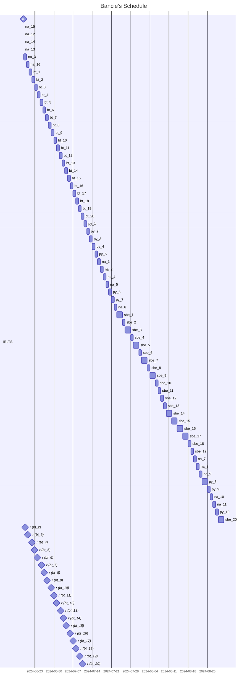

```mermaid
gantt
    title Bancie's Schedule
    udehcS sdateFormat DD-MM-YY
    section IELTS
        %(d) FINAL EXAM: milestone, 06-07-2025, 0d

        %---KHOÁ BASIC IELTS_29---
        (r) BASIC: done, milestone, 18-06-24, 0d
        (d) BASIC: milestone, 01-08-24, 0d

        %---KHOÁ PRONOUNCITAION---
        (r) PHÁT ÂM: done, milestone, p1, 14-06-24, 0d
        (d) PHÁT ÂM: milestone, after p1, 20d

        %---KHOÁ INTER IELTS_22---
        %(r) INTER: milestone, 27-08-24, 0d
        %(d) INTER: milestone, 26-10-24, 0d

    section STATISTICS
        %---SBE (prec)---
        (d) SBE: milestone, 01-09-24, 0d

    section PYTHON
        %---tutorial (prec)---
        (r) TUTORIALS: milestone, py1, 20-06-24, 0d
        (d) TUTORIALS: milestone, after py1, 20d

    section MACHINE LEARNING
```

# Contents
- [Basic formula](https://github.com/S-ROLL/notebook.maths/blob/main/Maths/BASIC-FORMULA/basic.ipynb)
- [Calculus]()
  - [Complex analysis](https://github.com/S-ROLL/notebook.maths/blob/main/Maths/CALCULUS/Complex-Analysis/ca.ipynb)
  - [Numerical methods](https://github.com/S-ROLL/notebook.maths/blob/main/Maths/CALCULUS/Numerical-Methods/nm.ipynb)
  - [Measure theory](https://github.com/S-ROLL/notebook.maths/blob/main/Maths/CALCULUS/Measure-theory/measure.ipynb)
  - [Differential equation](https://github.com/S-ROLL/notebook.maths/blob/main/Maths/CALCULUS/Differential-equation/differential.ipynb)
- [Set theory](https://github.com/S-ROLL/notebook.maths/blob/main/Maths/NUMBER-THEORY/Set-theory/set-theory.ipynb)
- [Probability]()
  - [Applied statistics](https://github.com/S-ROLL/notebook.maths/blob/main/Maths/PROBABILITY/Applied-Statistics/advance/advance-AS.ipynb)
  - [Machine learning](https://github.com/S-ROLL/notebook.maths/blob/main/Maths/PROBABILITY/Machine-Learning/ml.ipynb)
- [Optimization]()
  - [LFP](https://github.com/S-ROLL/notebook.maths/blob/main/NCKH/LFP/theory/LFP.ipynb)
  - [MILP]()
    - [Theory](https://github.com/S-ROLL/notebook.maths/blob/main/NCKH/MILP/theory/nckh.ipynb)
    - [Tests](https://github.com/S-ROLL/notebook.maths/blob/main/NCKH/MILP/tests/test_nckh.ipynb)

[Drive](https://drive.google.com/drive/u/1/folders/1HARdf9ZS6k-OPniwOIoeQKNms1sTe28c)
