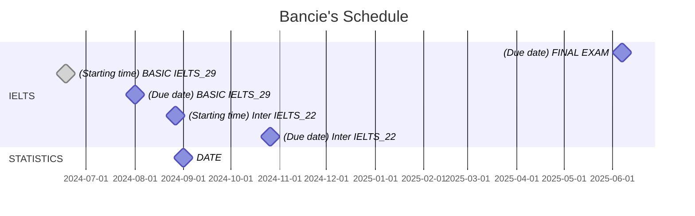

# Contents
- [Basic formula](https://github.com/S-ROLL/notebook.maths/blob/main/Maths/BASIC-FORMULA/basic.ipynb)
- [Calculus]()
  - [Complex analysis](https://github.com/S-ROLL/notebook.maths/blob/main/Maths/CALCULUS/Complex-Analysis/ca.ipynb)
  - [Numerical methods](https://github.com/S-ROLL/notebook.maths/blob/main/Maths/CALCULUS/Numerical-Methods/nm.ipynb)
  - [Measure theory](https://github.com/S-ROLL/notebook.maths/blob/main/Maths/CALCULUS/Measure-theory/measure.ipynb)
  - [Differential equation](https://github.com/S-ROLL/notebook.maths/blob/main/Maths/CALCULUS/Differential-equation/differential.ipynb)
- [Set theory](https://github.com/S-ROLL/notebook.maths/blob/main/Maths/NUMBER-THEORY/Set-theory/set-theory.ipynb)
- [Probability]()
  - [Applied statistics](https://github.com/S-ROLL/notebook.maths/blob/main/Maths/PROBABILITY/Applied-Statistics/advance/advance-AS.ipynb)
  - [Machine learning](https://github.com/S-ROLL/notebook.maths/blob/main/Maths/PROBABILITY/Machine-Learning/ml.ipynb)
- [Optimization]()
  - [LFP](https://github.com/S-ROLL/notebook.maths/blob/main/NCKH/LFP/theory/LFP.ipynb)
  - [MILP]()
    - [Theory](https://github.com/S-ROLL/notebook.maths/blob/main/NCKH/MILP/theory/nckh.ipynb)
    - [Tests](https://github.com/S-ROLL/notebook.maths/blob/main/NCKH/MILP/tests/test_nckh.ipynb)

[Drive](https://drive.google.com/drive/u/1/folders/1HARdf9ZS6k-OPniwOIoeQKNms1sTe28c)
