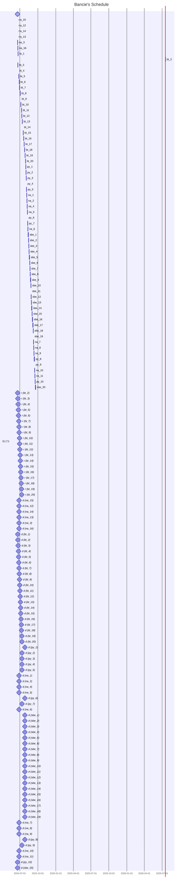
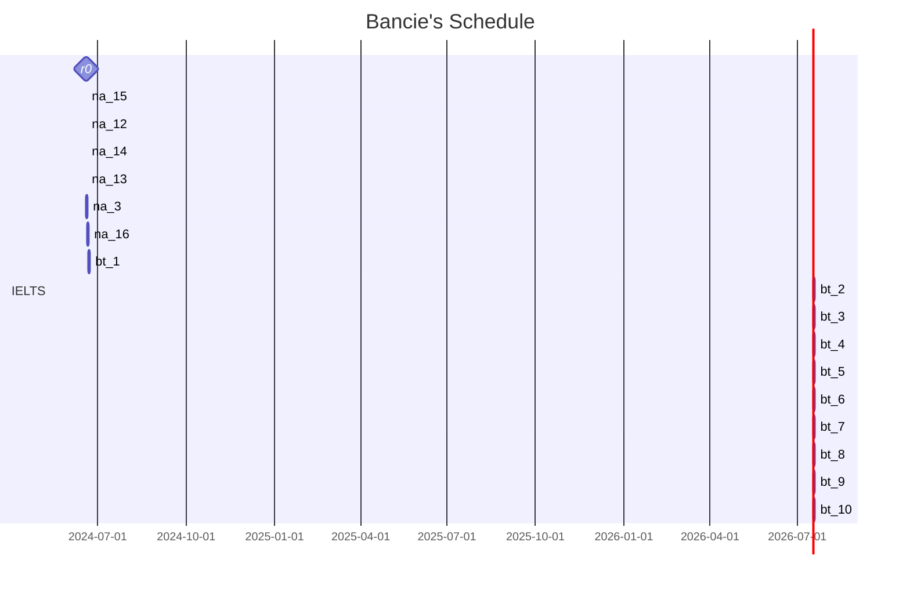

```mermaid
gantt
    title Bancie's Schedule
    dateFormat DD-MM-YY
    section IELTS
        r0: milestone, r0, 19-06-24, 0d
        na_15: na_15, 19-06-24, 0.1d
        na_12: na_12, after na_15, 0.2d
        na_14: na_14, after na_12, 0.3d
        na_13: na_13, after na_14, 0.3d
        na_3: na_3, after na_13, 0.5d
        na_16: na_16, after na_3, 0.7d
        bt_1: bt_1, after na_16, 1d
        bt_2: bt_2, after rbt_1, 1d
        bt_3: bt_3, after rbt_2, 1d
        bt_4: bt_4, after rbt_3, 1d
        bt_5: bt_5, after rbt_4, 1d
        bt_6: bt_6, after rbt_5, 1d
        bt_7: bt_7, after rbt_6, 1d
        bt_8: bt_8, after rbt_7, 1d
        bt_9: bt_9, after rbt_8, 1d
        bt_10: bt_10, after rbt_9, 1d
        bt_11: bt_11, after rbt_10, 1d
        bt_12: bt_12, after rbt_11, 1d
        bt_13: bt_13, after rbt_12, 1d
        bt_14: bt_14, after rbt_13, 1d
        bt_15: bt_15, after rbt_14, 1d
        bt_16: bt_16, after rbt_15, 1d
        bt_17: bt_17, after rbt_16, 1d
        bt_18: bt_18, after rbt_17, 1d
        bt_19: bt_19, after rbt_18, 1d
        bt_20: bt_20, after rbt_19, 1d
        py_1: py_1, after bt_20, 0.7d
        py_2: py_2, after py_1, 0.9d
        py_3: py_3, after py_2, 0.9d
        py_4: py_4, after py_3, 1.4d
        py_5: py_5, after py_4, 0.7d
        na_1: na_1, after py_5, 1.4d
        na_2: na_2, after na_1, 1.4d
        na_4: na_4, after na_2, 1.4d
        na_5: na_5, after na_4, 1.4d
        py_6: py_6, after na_5, 0.5d
        py_7: py_7, after py_6, 0.9d
        na_6: na_6, after py_7, 1.4d
        sbe_1: sbe_1, after na_6, 2.3d
        sbe_2: sbe_2, after sbe_1, 1.3d
        sbe_3: sbe_3, after sbe_2, 1.6d
        sbe_4: sbe_4, after sbe_3, 1.3d
        sbe_5: sbe_5, after sbe_4, 1.8d
        sbe_6: sbe_6, after sbe_5, 1d
        sbe_7: sbe_7, after sbe_6, 2.1d
        sbe_8: sbe_8, after sbe_7, 1d
        sbe_9: sbe_9, after sbe_8, 2.1d
        sbe_10: sbe_10, after sbe_9, 1d
        sbe_11: sbe_11, after sbe_10, 0.5d
        sbe_12: sbe_12, after sbe_11, 0.8d
        sbe_13: sbe_13, after sbe_12, 1.3d
        sbe_14: sbe_14, after sbe_13, 2.3d
        sbe_15: sbe_15, after sbe_14, 2.3d
        sbe_16: sbe_16, after sbe_15, 1.6d
        sbe_17: sbe_17, after sbe_16, 1.6d
        sbe_18: sbe_18, after sbe_17, 1.3d
        sbe_19: sbe_19, after sbe_18, 0.8d
        na_7: na_7, after sbe_19, 1.4d
        na_8: na_8, after na_7, 1.4d
        na_9: na_9, after na_8, 1.4d
        py_8: py_8, after na_9, 1.6d
        py_9: py_9, after py_8, 1.4d
        na_10: na_10, after py_9, 1.4d
        na_11: na_11, after na_10, 1.4d
        py_10: py_10, after na_11, 1.1d
        sbe_20: sbe_20, after py_10, 1.8d

        %---release time---
        r (bt_2): milestone, rbt_2, after r0, 1d
        r (bt_3): milestone,rbt_3, after r0, 3d
        r (bt_4): milestone,rbt_4, after r0, 6d
        r (bt_5): milestone,rbt_5, after r0, 8d
        r (bt_6): milestone,rbt_6, after r0, 10d
        r (bt_7): milestone,rbt_7, after r0, 13d
        r (bt_8): milestone,rbt_8, after r0, 15d
        r (bt_9): milestone,rbt_9, after r0, 17d
        r (bt_10): milestone,rbt_10, after r0, 20d
        r (bt_11): milestone,rbt_11, after r0, 22d
        r (bt_12): milestone,rbt_12, after r0, 24d
        r (bt_13): milestone,rbt_13, after r0, 27d
        r (bt_14): milestone,rbt_14, after r0, 29d
        r (bt_15): milestone,rbt_15, after r0, 31d
        r (bt_16): milestone,rbt_16, after r0, 34d
        r (bt_17): milestone,rbt_17, after r0, 36d
        r (bt_18): milestone,rbt_18, after r0, 38d
        r (bt_19): milestone,rbt_19, after r0, 41d
        r (bt_20): milestone,rbt_20, after r0, 43d

        %---due date---
        d (na_15): milestone, after r0, 15d
        d (na_12): milestone, after r0, 15d
        d (na_14): milestone, after r0, 15d
        d (na_13): milestone, after r0, 15d
        d (na_3): milestone, after r0, 15d
        d (na_16): milestone, after r0, 15d
        d (bt_1): milestone, after r0, 2d
        d (bt_2): milestone, after r0, 4d
        d (bt_3): milestone, after r0, 6d
        d (bt_4): milestone, after r0, 9d
        d (bt_5): milestone, after r0, 11d
        d (bt_6): milestone, after r0, 13d
        d (bt_7): milestone, after r0, 16d
        d (bt_8): milestone, after r0, 18d
        d (bt_9): milestone, after r0, 20d
        d (bt_10): milestone, after r0, 23d
        d (bt_11): milestone, after r0, 25d
        d (bt_12): milestone, after r0, 27d
        d (bt_13): milestone, after r0, 30d
        d (bt_14): milestone, after r0, 32d
        d (bt_15): milestone, after r0, 34d
        d (bt_16): milestone, after r0, 37d
        d (bt_17): milestone, after r0, 39d
        d (bt_18): milestone, after r0, 41d
        d (bt_19): milestone, after r0, 44d
        d (bt_20): milestone, after r0, 46d
        d (py_1): milestone, after r0, 75d
        d (py_2): milestone, after r0,  45d
        d (py_3): milestone, after r0,  45d
        d (py_4): milestone, after r0,  45d
        d (py_5): milestone, after r0,  45d
        d (na_1): milestone, after r0,  15d
        d (na_2): milestone, after r0,  15d
        d (na_4): milestone, after r0,  15d
        d (na_5): milestone, after r0,  15d
        d (py_6): milestone, after r0,  75d
        d (py_7): milestone, after r0,  45d
        d (na_6): milestone, after r0,  15d
        d (sbe_1): milestone, after r0,  75d
        d (sbe_2): milestone, after r0,  75d
        d (sbe_3): milestone, after r0,  75d
        d (sbe_4): milestone, after r0,  75d
        d (sbe_5): milestone, after r0,  75d
        d (sbe_6): milestone, after r0,  75d
        d (sbe_7): milestone, after r0,  75d
        d (sbe_8): milestone, after r0,  75d
        d (sbe_9): milestone, after r0,  75d
        d (sbe_10): milestone, after r0,  75d
        d (sbe_11): milestone, after r0,  75d
        d (sbe_12): milestone, after r0,  75d
        d (sbe_13): milestone, after r0,  75d
        d (sbe_14): milestone, after r0,  75d
        d (sbe_15): milestone, after r0,  75d
        d (sbe_16): milestone, after r0,  75d
        d (sbe_17): milestone, after r0,  75d
        d (sbe_18): milestone, after r0,  75d
        d (sbe_19): milestone, after r0,  75d
        d (na_7): milestone, after r0, 15d 
        d (na_8): milestone, after r0,  15d
        d (na_9): milestone, after r0,  15d
        d (py_8): milestone, after r0,  75d
        d (py_9): milestone, after r0,  45d
        d (na_10): milestone, after r0,  15d
        d (na_11): milestone, after r0,  15d
        d (py_10): milestone, after r0,  75
        d (sbe_20): milestone, after r0,  75
```

```mermaid
gantt
    title Bancie's Schedule
    dateFormat DD-MM-YY
    section IELTS
        r0: milestone, r0, 19-06-24, 0d
        na_15: na_15, 19-06-24, 0.1d
        na_12: na_12, after na_15, 0.2d
        na_14: na_14, after na_12, 0.3d
        na_13: na_13, after na_14, 0.3d
        na_3: na_3, after na_13, 0.5d
        na_16: na_16, after na_3, 0.7d
        bt_1: bt_1, after na_16, 1d
        bt_2: bt_2, after rbt_1, 1d
        bt_3: bt_3, after rbt_2, 1d
        bt_4: bt_4, after rbt_3, 1d
        bt_5: bt_5, after rbt_4, 1d
        bt_6: bt_6, after rbt_5, 1d
        bt_7: bt_7, after rbt_6, 1d
        bt_8: bt_8, after rbt_7, 1d
        bt_9: bt_9, after rbt_8, 1d
        bt_10: bt_10, after rbt_9, 1d
        %bt_11: bt_11, after rbt_10, 1d
        %bt_12: bt_12, after rbt_11, 1d
        %bt_13: bt_13, after rbt_12, 1d
        %bt_14: bt_14, after rbt_13, 1d
        %bt_15: bt_15, after rbt_14, 1d
        %bt_16: bt_16, after rbt_15, 1d
        %bt_17: bt_17, after rbt_16, 1d
        %bt_18: bt_18, after rbt_17, 1d
        %bt_19: bt_19, after rbt_18, 1d
        %bt_20: bt_20, after rbt_19, 1d
        %py_1: py_1, after bt_20, 0.7d
        %py_2: py_2, after py_1, 0.9d
        %py_3: py_3, after py_2, 0.9d
        %py_4: py_4, after py_3, 1.4d
        %py_5: py_5, after py_4, 0.7d
        %na_1: na_1, after py_5, 1.4d
        %na_2: na_2, after na_1, 1.4d
        %na_4: na_4, after na_2, 1.4d
        %na_5: na_5, after na_4, 1.4d
        %py_6: py_6, after na_5, 0.5d
        %py_7: py_7, after py_6, 0.9d
        %na_6: na_6, after py_7, 1.4d
        %sbe_1: sbe_1, after na_6, 2.3d
        %sbe_2: sbe_2, after sbe_1, 1.3d
        %sbe_3: sbe_3, after sbe_2, 1.6d
        %sbe_4: sbe_4, after sbe_3, 1.3d
        %sbe_5: sbe_5, after sbe_4, 1.8d
        %sbe_6: sbe_6, after sbe_5, 1d
        %sbe_7: sbe_7, after sbe_6, 2.1d
        %sbe_8: sbe_8, after sbe_7, 1d
        %sbe_9: sbe_9, after sbe_8, 2.1d
        %sbe_10: sbe_10, after sbe_9, 1d
        %sbe_11: sbe_11, after sbe_10, 0.5d
        %sbe_12: sbe_12, after sbe_11, 0.8d
        %sbe_13: sbe_13, after sbe_12, 1.3d
        %sbe_14: sbe_14, after sbe_13, 2.3d
        %sbe_15: sbe_15, after sbe_14, 2.3d
        %sbe_16: sbe_16, after sbe_15, 1.6d
        %sbe_17: sbe_17, after sbe_16, 1.6d
        %sbe_18: sbe_18, after sbe_17, 1.3d
        %sbe_19: sbe_19, after sbe_18, 0.8d
        %na_7: na_7, after sbe_19, 1.4d
        %na_8: na_8, after na_7, 1.4d
        %na_9: na_9, after na_8, 1.4d
        %py_8: py_8, after na_9, 1.6d
        %py_9: py_9, after py_8, 1.4d
        %na_10: na_10, after py_9, 1.4d
        %na_11: na_11, after na_10, 1.4d
        %py_10: py_10, after na_11, 1.1d
        %sbe_20: sbe_20, after py_10, 1.8d

        %%---release time---
        %r (bt_2): milestone, rbt_2, after r0, 1d
        %r (bt_3): milestone,rbt_3, after r0, 3d
        %r (bt_4): milestone,rbt_4, after r0, 6d
        %r (bt_5): milestone,rbt_5, after r0, 8d
        %r (bt_6): milestone,rbt_6, after r0, 10d
        %r (bt_7): milestone,rbt_7, after r0, 13d
        %r (bt_8): milestone,rbt_8, after r0, 15d
        %r (bt_9): milestone,rbt_9, after r0, 17d
        %r (bt_10): milestone,rbt_10, after r0, 20d
        %r (bt_11): milestone,rbt_11, after r0, 22d
        %r (bt_12): milestone,rbt_12, after r0, 24d
        %r (bt_13): milestone,rbt_13, after r0, 27d
        %r (bt_14): milestone,rbt_14, after r0, 29d
        %r (bt_15): milestone,rbt_15, after r0, 31d
        %r (bt_16): milestone,rbt_16, after r0, 34d
        %r (bt_17): milestone,rbt_17, after r0, 36d
        %r (bt_18): milestone,rbt_18, after r0, 38d
        %r (bt_19): milestone,rbt_19, after r0, 41d
        %r (bt_20): milestone,rbt_20, after r0, 43d

        %%---due date---
        %d (na_15): milestone, after r0, 15d
        %d (na_12): milestone, after r0, 15d
        %d (na_14): milestone, after r0, 15d
        %d (na_13): milestone, after r0, 15d
        %d (na_3): milestone, after r0, 15d
        %d (na_16): milestone, after r0, 15d
        %d (bt_1): milestone, after r0, 2d
        %d (bt_2): milestone, after r0, 4d
        %d (bt_3): milestone, after r0, 6d
        %d (bt_4): milestone, after r0, 9d
        %d (bt_5): milestone, after r0, 11d
        %d (bt_6): milestone, after r0, 13d
        %d (bt_7): milestone, after r0, 16d
        %d (bt_8): milestone, after r0, 18d
        %d (bt_9): milestone, after r0, 20d
        %d (bt_10): milestone, after r0, 23d
        %d (bt_11): milestone, after r0, 25d
        %d (bt_12): milestone, after r0, 27d
        %d (bt_13): milestone, after r0, 30d
        %d (bt_14): milestone, after r0, 32d
        %d (bt_15): milestone, after r0, 34d
        %d (bt_16): milestone, after r0, 37d
        %d (bt_17): milestone, after r0, 39d
        %d (bt_18): milestone, after r0, 41d
        %d (bt_19): milestone, after r0, 44d
        %d (bt_20): milestone, after r0, 46d
        %d (py_1): milestone, after r0, 75d
        %d (py_2): milestone, after r0,  45d
        %d (py_3): milestone, after r0,  45d
        %d (py_4): milestone, after r0,  45d
        %d (py_5): milestone, after r0,  45d
        %d (na_1): milestone, after r0,  15d
        %d (na_2): milestone, after r0,  15d
        %d (na_4): milestone, after r0,  15d
        %d (na_5): milestone, after r0,  15d
        %d (py_6): milestone, after r0,  75d
        %d (py_7): milestone, after r0,  45d
        %d (na_6): milestone, after r0,  15d
        %d (sbe_1): milestone, after r0,  75d
        %d (sbe_2): milestone, after r0,  75d
        %d (sbe_3): milestone, after r0,  75d
        %d (sbe_4): milestone, after r0,  75d
        %d (sbe_5): milestone, after r0,  75d
        %d (sbe_6): milestone, after r0,  75d
        %d (sbe_7): milestone, after r0,  75d
        %d (sbe_8): milestone, after r0,  75d
        %d (sbe_9): milestone, after r0,  75d
        %d (sbe_10): milestone, after r0,  75d
        %d (sbe_11): milestone, after r0,  75d
        %d (sbe_12): milestone, after r0,  75d
        %d (sbe_13): milestone, after r0,  75d
        %d (sbe_14): milestone, after r0,  75d
        %d (sbe_15): milestone, after r0,  75d
        %d (sbe_16): milestone, after r0,  75d
        %d (sbe_17): milestone, after r0,  75d
        %d (sbe_18): milestone, after r0,  75d
        %d (sbe_19): milestone, after r0,  75d
        %d (na_7): milestone, after r0, 15d 
        %d (na_8): milestone, after r0,  15d
        %d (na_9): milestone, after r0,  15d
        %d (py_8): milestone, after r0,  75d
        %d (py_9): milestone, after r0,  45d
        %d (na_10): milestone, after r0,  15d
        %d (na_11): milestone, after r0,  15d
        %d (py_10): milestone, after r0,  75
        %d (sbe_20): milestone, after r0,  75
```

