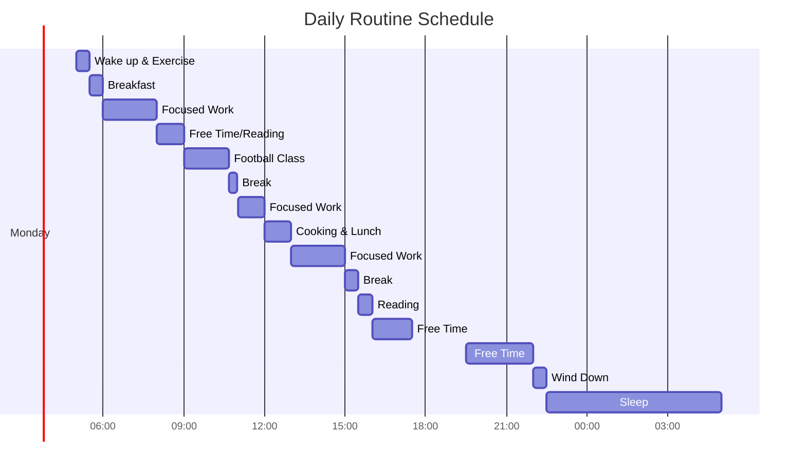
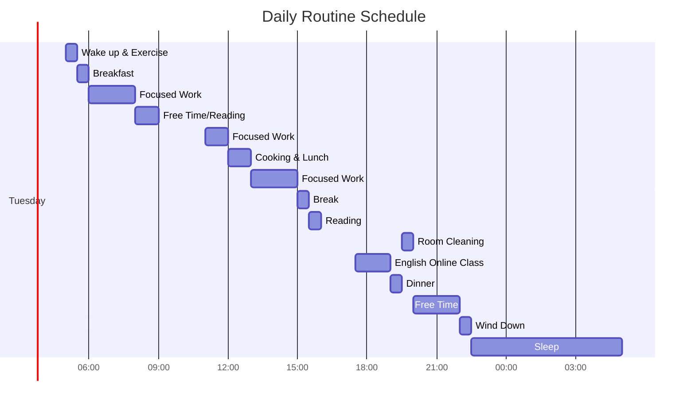
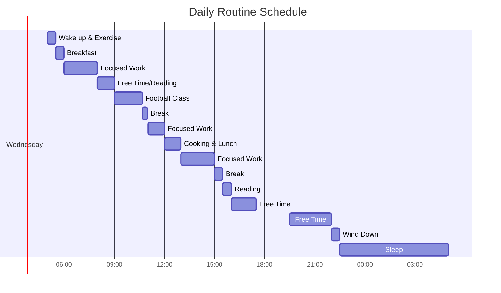
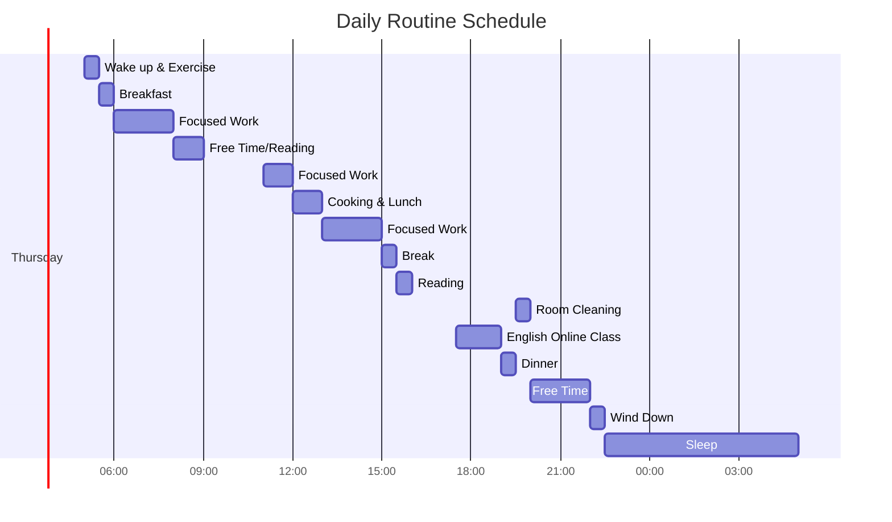
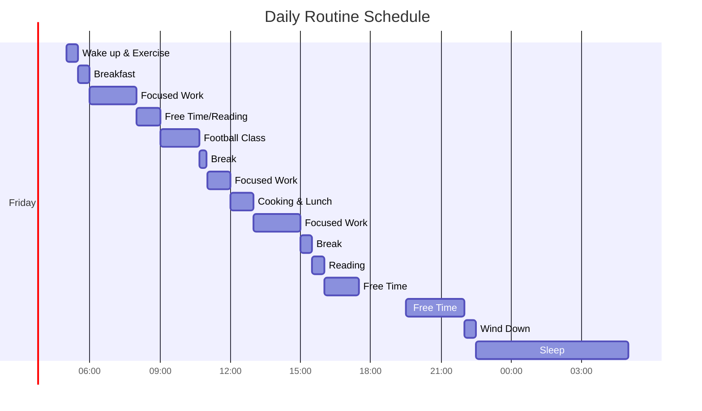
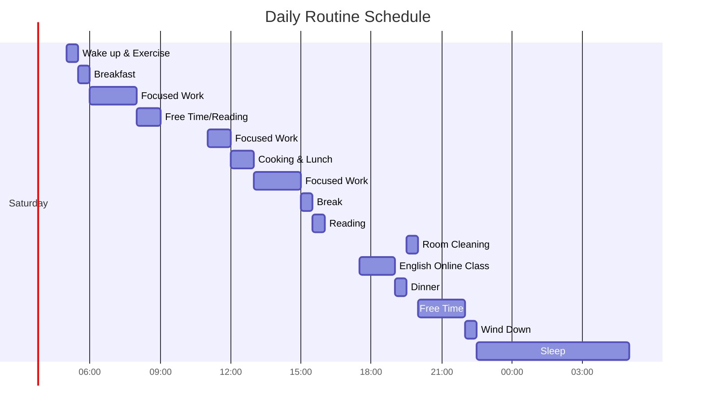
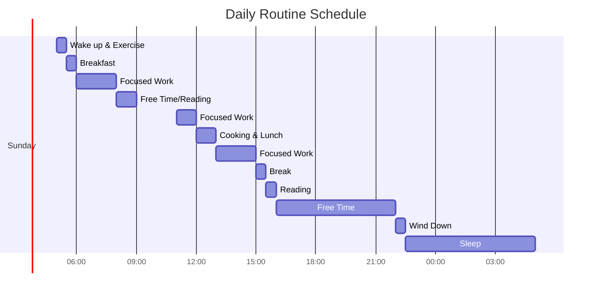

# Daily Schedule
## Monday

```mermaid
gantt
    title Daily Routine Schedule
    dateFormat  HH:mm
    axisFormat  %H:%M
    
    section Monday
    Wake up & Exercise       :05:00, 0.5h
    Breakfast                :05:30, 0.5h
    Focused Work             :06:00, 2h
    Free Time/Reading        :08:00, 1h
    Football Class           :09:00, 1.67h
    Break                    :10:40, 0.33h
    Focused Work             :11:00, 1h
    Cooking & Lunch          :12:00, 1h
    Focused Work             :13:00, 2h
    Break                    :15:00, 0.5h
    Reading                  :15:30, 0.5h
    Free Time                :16:00, 1.5h
    Free Time                :19:30, 2.5h
    Wind Down                :22:00, 0.5h
    Sleep                    :22:30, 6.5h
```
## Tuesday

```mermaid
gantt
    title Daily Routine Schedule
    dateFormat  HH:mm
    axisFormat  %H:%M
    
    section Tuesday
    Wake up & Exercise       :05:00, 0.5h
    Breakfast                :05:30, 0.5h
    Focused Work             :06:00, 2h
    Free Time/Reading        :08:00, 1h
    Focused Work             :11:00, 1h
    Cooking & Lunch          :12:00, 1h
    Focused Work             :13:00, 2h
    Break                    :15:00, 0.5h
    Reading                  :15:30, 0.5h
    Room Cleaning            :19:30, 0.5h
    English Online Class     :17:30, 1.5h
    Dinner                   :19:00, 0.5h
    Free Time                :20:00, 2h
    Wind Down                :22:00, 0.5h
    Sleep                    :22:30, 6.5h
```
## Wednesday

```mermaid
gantt
    title Daily Routine Schedule
    dateFormat  HH:mm
    axisFormat  %H:%M
    
    section Wednesday
    Wake up & Exercise       :05:00, 0.5h
    Breakfast                :05:30, 0.5h
    Focused Work             :06:00, 2h
    Free Time/Reading        :08:00, 1h
    Football Class           :09:00, 1.67h
    Break                    :10:40, 0.33h
    Focused Work             :11:00, 1h
    Cooking & Lunch          :12:00, 1h
    Focused Work             :13:00, 2h
    Break                    :15:00, 0.5h
    Reading                  :15:30, 0.5h
    Free Time                :16:00, 1.5h
    Free Time                :19:30, 2.5h
    Wind Down                :22:00, 0.5h
    Sleep                    :22:30, 6.5h
```
## Thursday

```mermaid
gantt
    title Daily Routine Schedule
    dateFormat  HH:mm
    axisFormat  %H:%M
    
    section Thursday
    Wake up & Exercise       :05:00, 0.5h
    Breakfast                :05:30, 0.5h
    Focused Work             :06:00, 2h
    Free Time/Reading        :08:00, 1h
    Focused Work             :11:00, 1h
    Cooking & Lunch          :12:00, 1h
    Focused Work             :13:00, 2h
    Break                    :15:00, 0.5h
    Reading                  :15:30, 0.5h
    Room Cleaning            :19:30, 0.5h
    English Online Class     :17:30, 1.5h
    Dinner                   :19:00, 0.5h
    Free Time                :20:00, 2h
    Wind Down                :22:00, 0.5h
    Sleep                    :22:30, 6.5h
```
## Friday

```mermaid
gantt
    title Daily Routine Schedule
    dateFormat  HH:mm
    axisFormat  %H:%M
    
    section Friday
    Wake up & Exercise       :05:00, 0.5h
    Breakfast                :05:30, 0.5h
    Focused Work             :06:00, 2h
    Free Time/Reading        :08:00, 1h
    Football Class           :09:00, 1.67h
    Break                    :10:40, 0.33h
    Focused Work             :11:00, 1h
    Cooking & Lunch          :12:00, 1h
    Focused Work             :13:00, 2h
    Break                    :15:00, 0.5h
    Reading                  :15:30, 0.5h
    Free Time                :16:00, 1.5h
    Free Time                :19:30, 2.5h
    Wind Down                :22:00, 0.5h
    Sleep                    :22:30, 6.5h
```
## Saturday

```mermaid
gantt
    title Daily Routine Schedule
    dateFormat  HH:mm
    axisFormat  %H:%M
    
    section Saturday
    Wake up & Exercise       :05:00, 0.5h
    Breakfast                :05:30, 0.5h
    Focused Work             :06:00, 2h
    Free Time/Reading        :08:00, 1h
    Focused Work             :11:00, 1h
    Cooking & Lunch          :12:00, 1h
    Focused Work             :13:00, 2h
    Break                    :15:00, 0.5h
    Reading                  :15:30, 0.5h
    Room Cleaning            :19:30, 0.5h
    English Online Class     :17:30, 1.5h
    Dinner                   :19:00, 0.5h
    Free Time                :20:00, 2h
    Wind Down                :22:00, 0.5h
    Sleep                    :22:30, 6.5h
```
## Sunday

```mermaid
gantt
    title Daily Routine Schedule
    dateFormat  HH:mm
    axisFormat  %H:%M
    
    section Sunday
    Wake up & Exercise       :05:00, 0.5h
    Breakfast                :05:30, 0.5h
    Focused Work             :06:00, 2h
    Free Time/Reading        :08:00, 1h
    Focused Work             :11:00, 1h
    Cooking & Lunch          :12:00, 1h
    Focused Work             :13:00, 2h
    Break                    :15:00, 0.5h
    Reading                  :15:30, 0.5h
    Free Time                :16:00, 6h
    Wind Down                :22:00, 0.5h
    Sleep                    :22:30, 6.5h
```